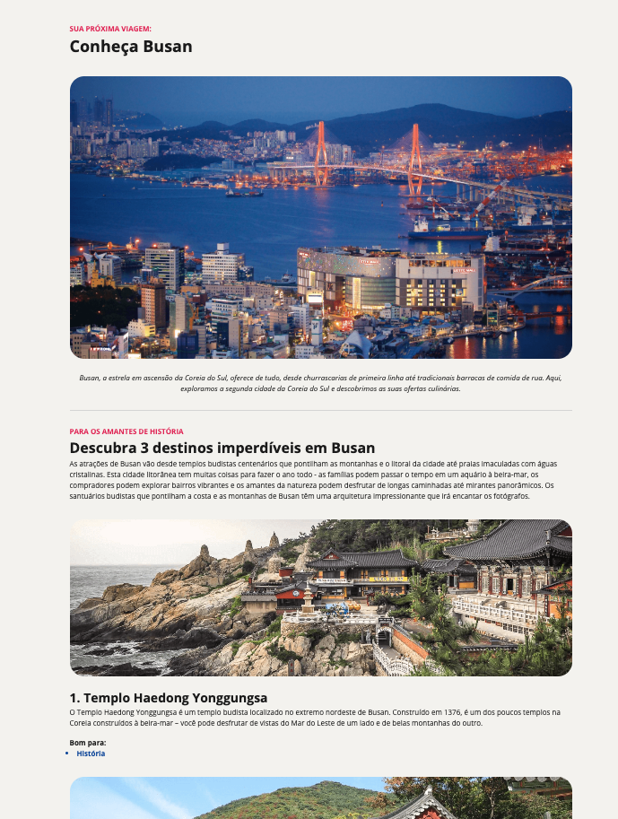

# 🌏 Discover Busan

This is a visually engaging travel landing page highlighting the beauty and culture of **Busan, South Korea**. The page was created as part of a frontend development exercise, focusing on **HTML5** and **CSS3** for layout, typography, and responsive design.

🔗 **[Live Preview](https://eugeniobarrosjr.github.io/tourist-site/)**

## 📸 Preview

<p align="center">
  
</p>

## ✈️ About the Project

This landing page invites users to discover **Busan**, a rising star in South Korea’s tourism scene. The page features a clean, modern layout that guides visitors through top historical and cultural spots in the city, supported by appealing visuals and descriptive content.

### Features

- Clean and responsive layout
- Informative and semantic content structure
- Highlights 3 key attractions in Busan
- Uses custom fonts and cohesive styling

## 🛠️ Tech Stack

- HTML5
- CSS3
- Google Fonts (Open Sans)

## 📂 Getting Started

To run this project locally:

```bash
git clone https://github.com/eugeniobarrosjr/tourist-site.git
cd tourist-site
open index.html
```

## 📃 License

This project is licensed under the MIT License.
